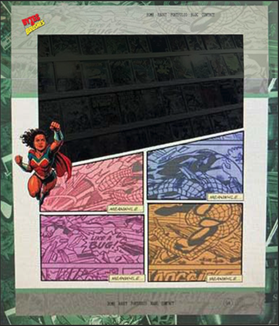

# Portfolio - React Edition 🎨💻

Welcome to my developer portfolio built with **React**! This site showcases my web projects, design skills, and development journey as I continue to grow in front-end development.

## 🚀 Live Demo
👉 [View Live Site](https://bytesandbrushes.com)

## 🛠️ Tech Stack
- React
- JavaScript (ES6+)
- CSS Modules / Tailwind CSS
- Git & GitHub
- Deployed via Vercel

## 🎨 Design Process & Final Layout
The portfolio design evolved through several stages, starting with layered wireframes and content mockups to plan the structure and user experience. This process helped shape a clean, modern homepage that balances visuals with functionality.

Below is the final polished homepage layout showcasing the result of this iterative design approach:

## 📂 Features
- Custom hero section with trapezoid design
- Interactive content buttons
- Responsive layout (desktop, tablet, mobile)
- Clean, minimal design inspired by comic book panels
- Layered UI layout using z-index and transparency

## 🚧 Work In Progress / Roadmap
This portfolio is an evolving project! Here’s what’s coming next:
- 🔹 Multi-page setup with React Router (Home, Projects, About, Challenges)  
- 🔹 Projects page showcasing apps like:  
- 🔹 Giphy API React app  
- 🔹 Tic Tac Toe game built in Python  
- 🔹 Coding challenges from tech meetups (Python)  
- 🔹 Live demos and interactive code samples for Python projects  
- 🔹 Improved UI/UX with animations and responsive design  
- 🔹 Regular updates reflecting new skills and projects  

Stay tuned — exciting things are in development! 🚀

## 🎯 Project Purpose
This portfolio is a living project created to:
- Practice modular React development
- Explore layered visual design and animation
- Provide a creative, professional hub for employers and collaborators

## 🤝 Connect with Me
Let's build something great together!  
- 🌐 Portfolio: [bytesandbrushes.com](https://bytesandbrushes.com)  
- 📸 Instagram: [@christynicholas-co](https://instagram.com/christynicholas.co)  
- 💻 GitHub: [@christynicholas-co](https://github.com/christynicholas-co/portfolio-react)  
- 📧 Email: christy@bytesandbrushes.com 
